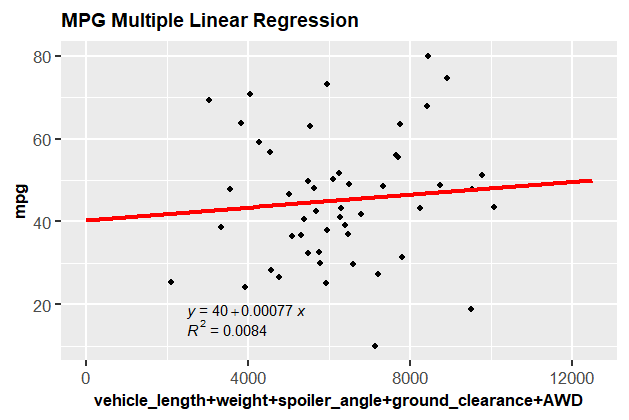
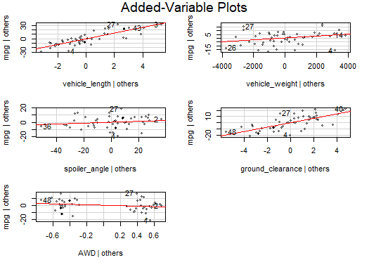
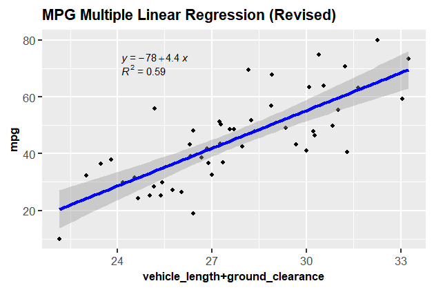
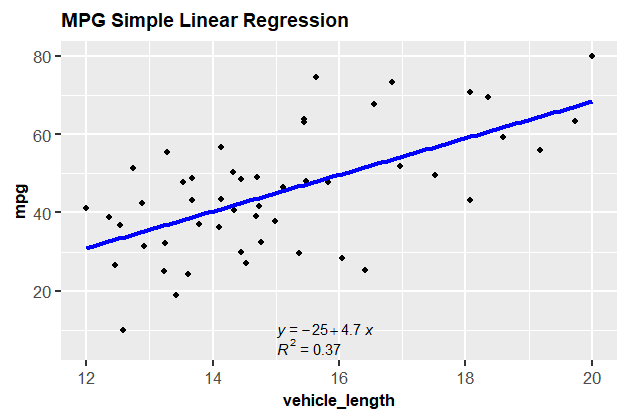
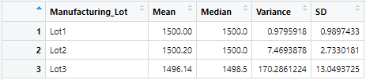
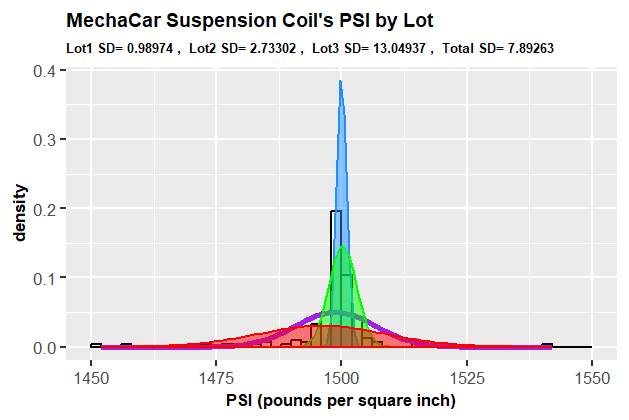
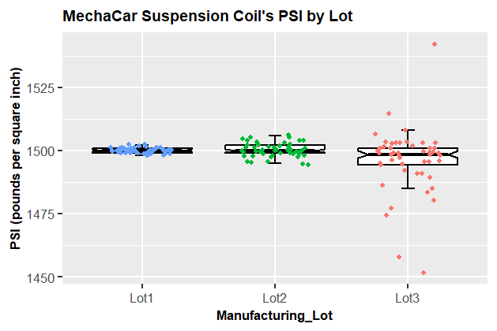
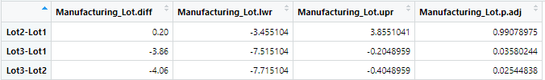
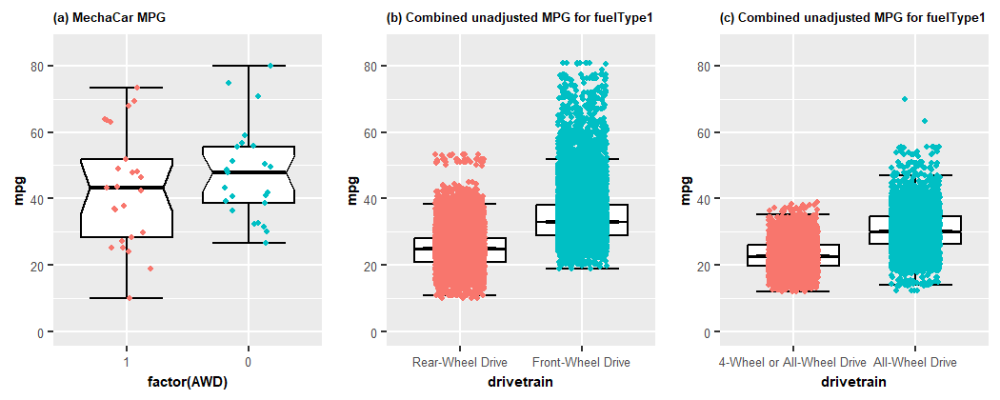

# MechaCar Statistical Analysis
This project focused on the application of R, statistical analyses, and ggplot2 for performing in-depth data analytics and visualizations of car production data.

## Table of Contents

- [Overview of Project](#overview-of-project)
  - [Resources](#resources)
  - [Challenge Overview](#challenge-overview)
  - [GitHub Repo Branches](#github-repo-branches)
- [Linear Regression to Predict MPG](#linear-regression-to-predict-mpg)
  - [Output from the Linear Model](#output-from-the-linear-model)
  - [Analysis Results of the Linear Model](#analysis-results-of-the-linear-model)
- [Summary Statistics on Suspension Coils](#summary-statistics-on-suspension-coils)
  - [Analysis Results and Visualizations](#analysis-results-and-visualizations)
- [T-Test on Suspension Coils](#t-test-on-suspension-coils)
- [Study Design: MechaCar vs Competition](#study-design-mechacar-vs-competition)
- [Summary](#summary)
- [References](#references)

## Overview of Project

This project and Module 16 assignment focused on cultivating knowledge and skills of statistics, R, and R packages for data science, which are widely used for data science as well as data analytics and visualizations. During the completion of this project we mainly leveraged the powerful features offered by [R: A Language and Environment for Statistical Computing](https://www.r-project.org/) and its supporting packages/libraries, popular open-source platforms that let us explore and study various statistical models and resources.

### Resources

- Source code: [MechaCarChallenge.R](./MechaCarChallenge.R)
- Source data: [MechaCar_mpg.csv](./Resources/MechaCar_mpg.csv), [Suspension_Coil.csv](./Resources/Suspension_Coil.csv), [vehicles.csv](./Resources/vehicles.csv) ([Downloadable Fuel Economy Data](https://www.fueleconomy.gov/feg/epadata/vehicles.csv.zip))
- Image file: png files
- Software: [R: A Language and Environment for Statistical Computing](https://www.r-project.org/), [RStudio](https://posit.co/), [ggplot2](https://ggplot2.tidyverse.org/reference/).

### Challenge Overview

Below is the outline of our deliverables and a written report for presenting our results and analysis summary. It consists of three technical analysis parts and a proposal for further statistical study.

- ☑️ Part 1: Linear Regression to Predict MPG.
- ☑️ Part 2: Summary Statistics on Suspension Coils.
- ☑️ Part 3: T-Test on Suspension Coils.
- ☑️ Part 4: Design a Study Comparing the MechaCar to the Competition.
- ☑️ Summary: A summary on our analysis results and visualizations (this ["README.md"](./README.md)).

### GitHub Repo Branches

All required deliverables are committed in this GitHub repo as outlined below.  

main branch  
|&rarr; [./README.md](./README.md)  
|&rarr; [./MechaCarChallenge.R](./MechaCarChallenge.R)  
|&rarr; ./Resources/  
  &emsp; |&rarr; [./Resources/MechaCar_mpg.csv](./Resources/MechaCar_mpg.csv)  
  &emsp; |&rarr; [./Resources/Suspension_Coil.csv](./Resources/Suspension_Coil.csv)  
  &emsp; |&rarr; [./Resources/vehicles.csv](./Resources/vehicles.csv)  
|&rarr; ./Data/  
  &emsp; |&rarr; [./Data/lm_MPG_Multiple_Linear_Regression.png](./Data/lm_MPG_Multiple_Linear_Regression.png)  
  &emsp; |&rarr; [./Data/lm_MPG_Multiple_Linear_Regression_av.png](./Data/lm_MPG_Multiple_Linear_Regression_rev.png)  
  &emsp; |&rarr; [./Data/lm_MPG_Multiple_Linear_Regression_rev.png](./Data/lm_MPG_Multiple_Linear_Regression_rev.png)  
  &emsp; |&rarr; [./Data/lm_vehicle_length_mpg.png](./Data/lm_vehicle_length_mpg.png)  
  &emsp; |&rarr; [./Data/total_summary_statistics_on_suspension_coils.png](./Data/total_summary_statistics_on_suspension_coils.png)  
  &emsp; |&rarr; [./Data/lot_summary_statistics_on_suspension_coils.png](./Data/lot_summary_statistics_on_suspension_coils.png)  
  &emsp; |&rarr; [./Data/lot_summary_TukeyHSD_on_suspension_coils.png](./Data/lot_summary_TukeyHSD_on_suspension_coils.png)  
  &emsp; |&rarr; [./Data/Suspension_Coil_dnorm.png](./Data/Suspension_Coil_dnorm.png)  
  &emsp; |&rarr; [./Data/Suspension_Coil_boxplot.png](./Data/Suspension_Coil_boxplot.png)  
  &emsp; |&rarr; [./Data/MechaCar_vs_Competitor_boxplot.png](./Data/MechaCar_vs_Competitor_boxplot.png)  

## Linear Regression to Predict MPG

We loaded the csv data, which consisted of 50 prototype MechaCars, and then used R's `lm()` function to perform multiple linear regression analyses and identify ideal vehicle performance (as dependent variable) against multiple vehicle metrics (as independent variables). The source code can be referred in [MechaCarChallenge.R](./MechaCarChallenge.R) and the summary statistics of the two models that I compared are shown below.

- **Model 1**: multiple linear model to predict MPG with 5 independent variables, vehicle_length + vehicle_weight + spoiler_angle + ground_clearance + AWD. We used `lm(mpg ~ vehicle_length+vehicle_weight+spoiler_angle+ground_clearance+AWD, df)` function in R to perform our prediction.
- **Model 2**: multiple linear model to predict MPG with independent variables reduced to 2, vehicle_length + ground_clearance, which both showed p-value &leq; 0.05 (referred as *significance level*) based on our preliminary linear model and visualizations (Fig. 1&ndash;2). We used `lm(mpg ~ vehicle_length+ground_clearance, df)` function in R to validate our prediction further.

### Output from the Linear Model

Below are the summary statistics of the two models. Fig. 1 and Fig. 2 show the scatter plots and the corresponding fitted multiple linear regression line of **Model 1**. I adopted `avPlots()` function to further visualize which independent variables influenced the dependent variable, MPG, more significantly (Fig. 2). Fig. 3 shows the scatter plots and the corresponding fitted multiple linear regression line for the adjusted **Model 2**.

```
# Model 1
# Call:
#   lm(formula = mpg ~ vehicle_length + vehicle_weight + spoiler_angle + ground_clearance + AWD, data = df)
# 
# Residuals:
#   Min       1Q      Median     3Q      Max 
# -19.4701  -4.4994  -0.0692   5.4433  18.5849 
# 
# Coefficients:
#                    Estimate    Std. Error t value Pr(>|t|)    
#   (Intercept)      -1.040e+02  1.585e+01  -6.559  5.08e-08 ***
#   vehicle_length    6.267e+00  6.553e-01   9.563  2.60e-12 ***
#   vehicle_weight    1.245e-03  6.890e-04   1.807    0.0776 .  
#   spoiler_angle     6.877e-02  6.653e-02   1.034    0.3069    
#   ground_clearance  3.546e+00  5.412e-01   6.551  5.21e-08 ***
#   AWD              -3.411e+00  2.535e+00  -1.346    0.1852    
#   ---
#   Signif. codes:  0 ‘***’ 0.001 ‘**’ 0.01 ‘*’ 0.05 ‘.’ 0.1 ‘ ’ 1
# 
# Residual standard error: 8.774 on 44 degrees of freedom
# Multiple R-squared:  0.7149,	Adjusted R-squared:  0.6825 
# F-statistic: 22.07 on 5 and 44 DF,  p-value: 5.35e-11
```

```
# Model 2
# Call:
#   lm(formula = mpg ~ vehicle_length + ground_clearance, data = df)
# 
# Residuals:
#   Min      1Q     Median    3Q     Max 
# -17.493  -7.705   1.344   6.642  18.500 
# 
# Coefficients:
#                    Estimate    Std. Error t value Pr(>|t|)    
#   (Intercept)      -91.5573    13.9649    -6.556  3.86e-08 ***
#   vehicle_length     6.0811     0.6732     9.033  7.68e-12 ***
#   ground_clearance   3.5669     0.5401     6.604  3.26e-08 ***
#   ---
#   Signif. codes:  0 ‘***’ 0.001 ‘**’ 0.01 ‘*’ 0.05 ‘.’ 0.1 ‘ ’ 1
# 
# Residual standard error: 9.078 on 47 degrees of freedom
# Multiple R-squared:  0.674,	Adjusted R-squared:  0.6601 
# F-statistic: 48.59 on 2 and 47 DF,  p-value: 3.637e-12
```

  
**Fig. 1 MPG fitted linear regression of Model 1.**

  
**Fig. 2 Added-variable plots of Model 1.**

  
**Fig. 3 MPG fitted linear regression of Model 2.**

### Analysis Results of the Linear Model

During this assignment, we extensively used R, RStudio, and ggplot2 to perform in-depth statistical analyses and visualizations. We also applied our knowledge of statistical hypothesis tests and models, including Student's t-test, simple vs multiple linear models, null vs alternative hypotheses, and so on. Based on our analysis results, we were able to address the following questions:

- Which variables/coefficients provided a non-random amount of variance to the mpg values in the dataset?  
&ensp;💡 Two variables, vehicle_length and ground_clearance, provided statistically significant non-random amount of variance to the mpg values in the dataset. Because the rest of independent variables showed p-value > 0.05, none of them in our model was significantly influencing MPG. Further analysis confirmed that none of vehicle_weight, spoiler_angle, or AWD had statistically significant relationship to MPG (-0.145 &leq; correlation coefficient < 0.145 in **Table 2**) except for AWD, which showed very weak negative correlation with MPG.

- Is the slope of the linear model considered to be zero? Why or why not?  
&ensp;💡 The slope of our multiple linear regression models was not equal to zero or at least one of the slope parameters was not equal to 0 because both models showed F-value > 22 and p-value associated with the F-statistic &leq; 0.05 ([Output from the Linear Model](#output-from-the-linear-model)) as also summarized in **Table 1**, though the slope of the multiple linear model based on our fitted linear regression of **Model 1** was approximately **0.00077**, which was considerably small (Fig. 1). In contrast with the statistics of **Model 1**, **Model 2** showed much better overall statistics, including F-value (**48.59**), p-value associated with the F-statistic (**3.637e-12**), slope parameter (**4.4**), and R<sup>2</sup> (**59%**) as depicted in Fig. 3.

- Does this linear model predict mpg of MechaCar prototypes effectively? Why or why not?  
&ensp;💡 Yes, it predicted mpg of MechaCar prototypes effectively because R<sup>2</sup> (coefficient of determination) of the model indicated that over **71.49%** of the variance of mpg being studied was explained by the variance of the multiple independent variables, although R<sup>2</sup> above 75% is normally considered statistically good depending on the field of studies. The adjusted R<sup>2</sup>, which minimizes the effect of adding unrelated independent variables or overfitting, is considered a better representation of multiple linear model and was over **68.25%** or only **2.24%** higher than that of **Model 2** as summarized in **Table 1**. The main drawback of our multiple linear model was its inability to isolate the variance of mpg that was not well described by three independent variables, vehicle_weight, spoiler_angle, or AWD. The preliminary linear model was only effective because it let us conduct further tests.

**Table 1. Summary statistics of the multiple regression models to predict MPG.**  
| R<sup>2</sup>	         | Model 1 (5 variables) | Model 2 (2 variables) |
| :--                    |                  :--: |                  :--: |
| Multiple R<sup>2</sup> |  0.7149               |  0.6740               |
| Adjusted R<sup>2</sup> |  0.6825               |  0.6601               |
| F-value                |  22.07                |  48.59                |
| Associated p-value     |  5.35e-11             |  3.637e-12            |

**Table 2. Strength of correlation between the independent variables and MPG.**  
| Independent variable  | *r* (correlation coefficient) | Strength of correlation           |
| :--                   |                           --: |                               --: |
| vehicle_length        |  0.60947984                   |  Moderate (positive correlation)  |
| vehicle_weight        |  0.09068314                   |  None or very weak                |
| spoiler_angle         | -0.02083999                   |  None or very weak                |
| ground_clearance      |  0.32874886                   |  Weak (positive)                  |
| AWD                   | -0.14166977                   |  Very weak (negative correlation) |

The summary statistics of the multiple regression models to predict MPG also suggested that:

- Hypothesis test for the y-intercept (&beta;<sub>0</sub>) confirmed that p-value of the intercept for both models was significantly &lt; 0.05. This indicated that
  - the population intercept is not equal to 0 in most cases,
  - the null hypothesis (&beta;<sub>0</sub>=0) should be rejected and the alternative hypothesis (H<sub>A</sub>) could be used instead.
- F-value is considerably high, **22.07** for **Model 1** and **48.59** for **Model 2**, which generally suggested that **Model 2** would probably be a better model. Both models also had associated p-value &leq; 0.05, which further concluded that at least one independent variable in each model was statistically related to the dependent variable (MPG in this case).
- R<sup>2</sup> does not necessarily forecast how good the correlation between the independent and dependent variables is. To analyze further, we could use `cor()` function to reveal the correlation coefficients in **Table 2** or a simple regression model and fitted regression line (e.g. Fig. 4).

  
**Fig. 4 Fitted linear regression of a predictor (vehicle_length) vs MPG.**

## Summary Statistics on Suspension Coils

The MechaCar [Suspension_Coil.csv](./Resources/Suspension_Coil.csv) dataset contained the results from multiple production lots. In this dataset, the weight capacities of multiple suspension coils were tested to determine if the manufacturing process is consistent across production lots. Using our knowledge of R, we created a summary statistics table to show the measures of central tendency and variability of the suspension coil's PSI data. **Table 3** and **Table 4** show the summary statistics of `total_summary` and `lot_summary` dataframes, which were identical to the screenshots in Module 16 assignment.

- The suspension coil’s PSI continuous variable across all manufacturing lots (**Table 3**).
- The following PSI metrics for each lot: mean, median, variance, and standard deviation (**Table 4**).

**Table 3. Measures of central tendency and variability of the suspension coil’s PSI (pounds per square inch).**  


**Table 4. Measures of central tendency and variability of the suspension coil’s PSI by lot (pounds per square inch).**  


### Analysis Results and Visualizations

Based on our analysis results and visualizations, we were able to address the following questions:

- The design specifications for the MechaCar suspension coils dictate that the variance of the suspension coils must not exceed 100 pounds per square inch (psi). Does the current manufacturing data meet this design specification for all manufacturing lots in total and each lot individually? Why or why not?  
&ensp;💡 The current manufacturing data met the design specification for all manufacturing lots in total because the variance of the suspension coils was **62.29356**, which is &lt; 100 psi (**Table 1**).  
&ensp;💡 The current manufacturing data for lot number **Lot3** failed to clear the design specification, especially in terms of reliable variance and standard deviation criteria, because the variance of the suspension coils for **Lot3** was **170.2861224**, which is significantly &gt; 100 psi (**Table 2**). **Lot3** also showed the worst standard deviation performance (**13.0493725 psi** in **Table 2**) when compared to the other lots.

Further research into each manufacturing lot confirmed that **Lot3** had the largest variability from the lot's population mean and the largest spread from one another, and also contained several outliers as illustrated in Fig. 5&ndash;6. Fig. 5 used R's probability density function `dnorm` to graph an approximation to the normal distribution of MechaCar suspension coil's PSI data.

  
**Fig. 5 Bell curves of MechaCar suspension coil's PSI by Manufacturing_Lot (🔵Lot1, 🟢Lot2, 🔴Lot3, 🟣Total).**

  
**Fig. 6 Boxplots of MechaCar suspension coil's PSI by Manufacturing_Lot.**

## T-Test on Suspension Coils

Using our knowledge of R, we performed t-tests to determine if all manufacturing lots and each lot individually are statistically different from the population mean of 1500 psi.

- In our [MechaCarChallenge.R](./MechaCarChallenge.R) script, we tested our dataset using the `t.test()` function to determine if the PSI across all manufacturing lots is statistically different from the population mean of 1500 psi.
- Next, we used the `t.test()` function and its `subset()` argument to determine if the PSI for each manufacturing lot is statistically different from the population mean of 1500 psi.

The code snippet for the t-test and one-way analysis of variance (ANOVA) tests is outlined below. The ANOVA test in addition to the t-test was especially useful for understanding the difference across multiple manufacturing lots. The condensed summary statistics and conclusions in **Table 5&ndash;6** concluded our hypothesis tests and findings. Results of both t-test and ANOVA tests reconfirmed that **Lot 3** was statistically different from the population mean.

```
# Read in the csv file as a dataframe
df2  <- read.csv("./Resources/Suspension_Coil.csv", check.names = F, stringsAsFactors = F)
lot1 <- subset(df2, Manufacturing_Lot == 'Lot1')
lot2 <- subset(df2, Manufacturing_Lot == 'Lot2')
lot3 <- subset(df2, Manufacturing_Lot == 'Lot3')

# Part 3: T-Test on Suspension Coils
stdmu = 1500 #given population mean of 1500 psi to compare against
# One Sample t-test vs the standard mean
t.test(df2[['PSI']], mu=stdmu)
t.test(lot1[['PSI']], mu=stdmu)
t.test(lot2[['PSI']], mu=stdmu)
t.test(lot3[['PSI']], mu=stdmu)

# paired t-test
t.test(lot1[['PSI']], lot2[['PSI']], paired = TRUE) 
t.test(lot1[['PSI']], lot3[['PSI']], paired = TRUE)
t.test(lot2[['PSI']], lot3[['PSI']], paired = TRUE)

# ANOVA test
aov_lot <- aov(PSI ~ Manufacturing_Lot, data=df2)
summary(aov_lot) # Summary statistics
lot_summary_Tukey <- TukeyHSD(aov_lot, conf.level = 0.95) # Summary statistics (default conf.level = 0.95)
view(lot_summary_Tukey)
```

**Table 5. Condensed summary statistics of the t-test to determine if the PSI across all manufacturing lots is statistically different from the population mean of 1500 psi.**  
| T-test     | Data source   | t value  | DF  | p-value | Conclusion                             |
| :--        | :--           |      --: | --: |     --: | :--:                                   |
| One Sample | df2[["PSI"]]  | -1.8931  | 149 | 0.06028 | Null hypothesis (H<sub>0</sub>)        |
| One Sample | lot1[["PSI"]] |       0  | 49  |       1 | Null hypothesis (H<sub>0</sub>)        |
| One Sample | lot2[["PSI"]] | 0.51745  | 49  | 0.6072  | Null hypothesis (H<sub>0</sub>)        |
| One Sample | lot3[["PSI"]] | -2.0916  | 49  | 0.04168 | Alternative hypothesis (H<sub>A</sub>) |
| Paired | lot1[["PSI"]] & lot2[["PSI"]] | -0.52031 | 49  | 0.6052  | Null hypothesis (H<sub>0</sub>)        |
| Paired | lot1[["PSI"]] & lot3[["PSI"]] |  2.0728  | 49  | 0.04347 | Alternative hypothesis (H<sub>A</sub>) |
| Paired | lot2[["PSI"]] & lot3[["PSI"]] |  2.0883  | 49  | 0.04199 | Alternative hypothesis (H<sub>A</sub>) |

**Table 6. Summary statistics of the ANOVA test to further understand the PSI performance across all manufacturing lots.**  


## Study Design: MechaCar vs Competition

Using our knowledge of R, we designed a statistical study to compare the performance of MechaCar vehicles against the performance of vehicles from other manufacturers. We are required to write a short description of a statistical study that can quantify how the MechaCar performs against the competition. In this study design, I used the fuel economy dataset published by the U.S. Environmental Protection Agency ([Downloadable Fuel Economy Data](https://www.fueleconomy.gov/feg/epadata/vehicles.csv.zip)), and chose the combined city/highway fuel efficiency of fuelType1 vehicles and drivetrain as metrics. The source code for verifying the proof of concept can also be found in [MechaCarChallenge.R](./MechaCarChallenge.R).

- What metric or metrics are you going to test?
  - *mpg* as a dependent variable (continuous) and *drivetrain* as an independent variable (discrete). The fuelType is limited to fuelType1 only.
- What is the null hypothesis or alternative hypothesis?
  - The null hypothesis (H<sub>0</sub>) was defined based on the average combined city/highway fuel efficiency that was published by the U.S. Environmental Protection Agency, either **30.70** for All-Wheel Drive drivetrain or **34.62** for Front-Wheel Drive drivetrain. These values could be derived by running the following code snippet or by analyzing specific graphical visualizations (Fig. 7).
  - The alternative hypothesis (H<sub>A</sub>) would require p-value to be &leq; 0.05.
- What statistical test would you use to test the hypothesis? And why?
  - T-test, ANOVA test, and graphical visualizations, such as boxplots and probability density function (PDF). Fig. 7 illustrated some possible analytics and visualizations that would be useful when comparing the performance of MechaCar's *mpg* vs the competitors' *mpg*.
- What data is needed to run the statistical test?
  - As for One Sample t-test, I compared the performance of MechaCar's *mpg* with the mean of the standard combined city/highway *mpg*.
  - As for ANOVA test and graphical visualizations, unlike *drive* data in the fuel economy dataset, I had to use R's `factor()` function to first convert the continuous *AWD* data from [MechaCar_mpg.csv](./Resources/MechaCar_mpg.csv) to a discrete data type before we could perform test and visualizations on several drivetrains.

```
# Read in the csv file as a dataframe
vehicles <- read.csv("./Resources/vehicles.csv", check.names = F, stringsAsFactors = F)
# create a subset named competitor
competitor <- vehicles %>% select(city08, comb08, drive, highway08, phevBlended, trany, UCity, UHighway) %>% 
  mutate(mpg08 = (city08+highway08)/2, mpg = (UCity+UHighway)/2) %>% 
  as.data.frame()
# clean data and outliers
comp_awd <- competitor[grep("All-Wheel Drive", competitor$drive, ignore.case = TRUE), ] %>%
  filter(trany != 'Automatic (A1)' & trany != 'Automatic (A2)' & mpg08 > 1 & mpg > 1)
comp_fwd <- competitor[grep("Front-Wheel Drive", competitor$drive, ignore.case = TRUE), ] %>%
  filter(trany != 'Automatic (A1)' & trany != 'Automatic (A2)' & mpg08 > 1 & mpg > 1 & mpg08 < 85 & mpg < 85)
comp_rwd <- competitor[grep("Rear-Wheel Drive", competitor$drive, ignore.case = TRUE), ] %>%
  filter(trany != 'Automatic (A1)' & trany != 'Automatic (A2)' & mpg08 > 1 & mpg > 1 & mpg08 < 85 & mpg < 85)
comp_frwd <- list(comp_fwd, comp_rwd) %>% reduce(full_join, all = TRUE)
comp_awd0 <- subset(comp_awd, drive == 'All-Wheel Drive')
summary(comp_awd0)
summary(comp_fwd)

# One sample t-test: hypothesis vs competition's average unadjusted mpg
t.test(awd0$mpg, mu=mean(comp_awd0$mpg))
t.test(awd0$mpg, mu=mean(comp_fwd$mpg))

# ANOVA test
aov_mechacar <- aov(mpg ~ factor(AWD), data=df)
summary(aov_mechacar) # Summary statistics
aov_mechacar_Tukey <- TukeyHSD(aov_mechacar, conf.level = 0.95) # Summary statistics (default conf.level = 0.95)
view(aov_mechacar_Tukey)
```

  
**Fig. 7 Boxplots of MechaCar vs Competition in terms of combined MPG: (a) MechaCar MPG, (b) Competitors' unadjusted MPG for fuelType1, and (c) Competitors' unadjusted MPG for fuelType1.**

## Summary

Our test results and p-value &leq; 0.05 confirmed that the performance of MechaCar's *mpg* was highly competitive and significantly better compared to the competitors' *mpg* (fuelType1 vehicles). The test results also suggested that drivetrains statistically affect the fuel efficiency and some recent advances in AWD technology has improved AWD vehicles' fuel efficiency in general.

All deliverables have been completed and analyzed according to the assignment requirements, including code refactoring, avoiding deprecated R's features, and quality assurance for ensuring accurate results. I hope users and stakeholders will be able to benefit from various visualizations in addition to the summary statistics tables and easily explore our analysis summary before drawing the final conclusions.

## References

[R: A Language and Environment for Statistical Computing](https://www.r-project.org/)  
[RStudio](https://posit.co/)  
[ggplot2](https://ggplot2.tidyverse.org/reference/)  
[avPlots: Added-Variable Plots](https://www.rdocumentation.org/packages/car/versions/3.1-1/topics/avPlots)  
[How to Add a Regression Equation to a Plot in R](https://www.statology.org/add-regression-equation-to-plot-in-r/)  
[Set the size of ggsave exactly - Stack Overflow](https://stackoverflow.com/questions/44711236/set-the-size-of-ggsave-exactly)  
[Side-by-side plots with ggplot2 - Stack Overflow](https://stackoverflow.com/questions/1249548/side-by-side-plots-with-ggplot2)  
[Online Statistics Education: A Multimedia Course of Study](https://onlinestatbook.com/2/index.html)  
[Linear regression models](https://people.duke.edu/~rnau/regintro.htm)  
[STAT 501: Regression Methods](https://online.stat.psu.edu/stat501/lesson/1/1.5)  
[FuelEconomy.gov Web Services](https://www.fueleconomy.gov/feg/ws/index.shtml#vehicle)  
[emoji-cheat-sheet](https://github.com/ikatyang/emoji-cheat-sheet/blob/master/README.md)  
